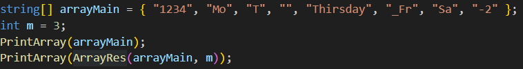
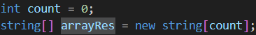
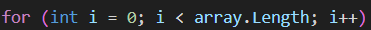
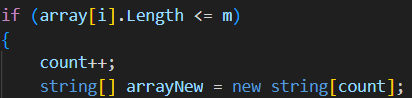
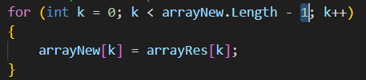
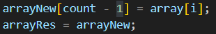
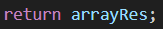
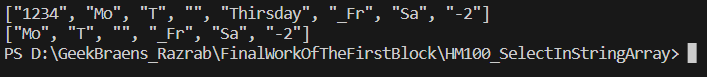

# README
---
## Итоговая контрольная работа
основной блок

___

#### ___Задача___
_Условие:_
>Написать программу, которая из имеющегося массива строк формирует новый массив из строк, длина которых меньше, либо равна 3 символам. Первоначальный массив можно ввести с клавиатуры, либо задать на старте выполнения алгоритма. При решении не рекомендуется пользоваться коллекциями, лучше обойтись исключительно массивами.

_Примеры:_
>[“Hello”, “2”, “world”, “:-)”] → [“2”, “:-)”]
[“1234”, “1567”, “-2”, “computer science”] → [“-2”]
[“Russia”, “Denmark”, “Kazan”] → []

___

## Решение

Программа содержит строки для задания исходного массива _arrayMain_, и количества символов _m_ согласно условию. Далее в программе последовательно вызывается метод печати исходного массива, а затем метод печати массива, полученного с помощью главного метода __ArrayRes__.

####Метод ArrayRes
Для начала создаем переменную для длины массива _count_, который стремимся получить и создаем новый (результирующий) массив _arrayRes_.

Метод _ArrayRes_ содержит цикл __For__ в котором мы пробегаемся по элементам заданного массива _arrayMain_ (или в методе он назван как _array_).

Далее проверяем условие __if__ и если длина строки текущего элемента меньше либо равна заданному кол-ву символов, то создаем новый массив _arrayNew_ с длиной большей на единицу, относительно предыдущего значения _count_.

Далее в цикле __For__ проходим по элементам нового массива _arrayNew_ (кроме последнего) и переписываем в него значения из массива _arrayRes_.

Таким образом, получаем два одинаковых массива, но _arrayNew[count-1]_ = 0 (т.е. последний элемент нового массива пока остается пуст). По окончании цикла __For__, записываем текущее значение исходного массива _array[i]_ в _arrayNew[count-1]_, а результирующему массиву присваиваем значение нового массива.

Когда условие array[i].Length <= m более не выполняется и все элементы исходного массива проверены, метод возвращает массив arrayRes.

___

#### ___Результат выполнения задачи___

___

[
Ссылка на блок-схему](https://drive.google.com/file/d/1kb3kthg9Mbl5acuot6GQYQBBgYv-wvZL/view?usp=sharing)

